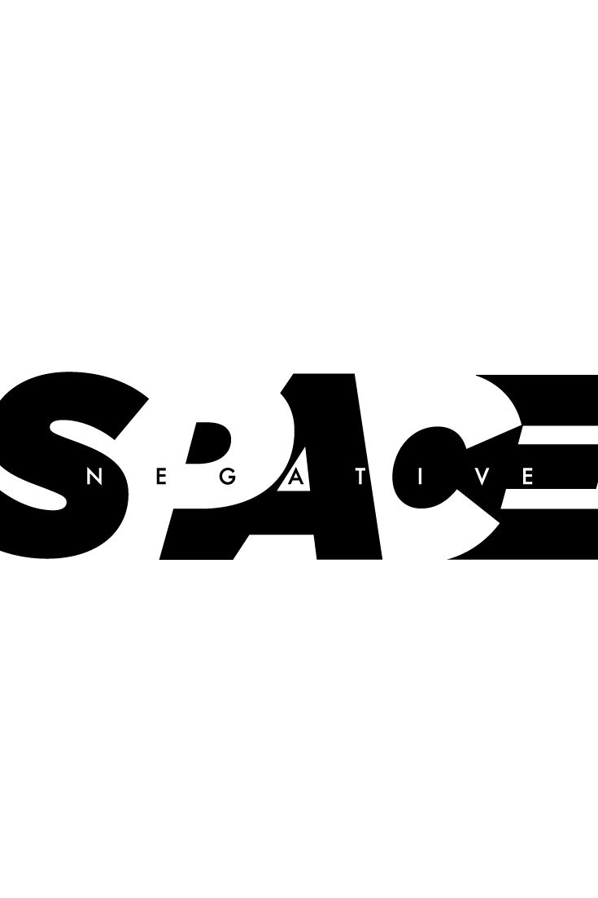
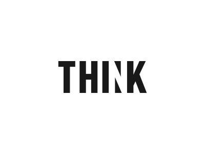
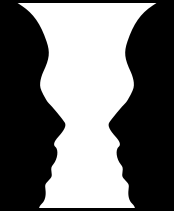

I have been reading this book called [Can AI Think?](https://www.adlibris.com/se/bok/kan-ai-tanka-om-manniskor-djur-och-robotar-9789189732490) by _Peter Gärdenfors_. It's a great read and I highly recommend it. Peter talks about how the human brain works, how we differ from animals, how we don't, and how a brain is not just a computer. There are so many nuances that come into play when the brain parses information and it would be impossible for a computer to replicate all these.
It got me thinking about how we perceive the world around us and how this relates to design. 
 Basically, we see the world in patterns and shapes, and our brains are wired to recognize these patterns quickly and efficiently.
Take the picture below for example.

 Why is it that we see a triangle to the left &#8592; and a panda to the right &#8594; ? 
They are not actually there, there's just three pacman-lookalikes and some random black blobs, but our brains fill in the gaps and create a complete image. This is called the _closure principle_ and it's one of the many principles of _Gestalt theory_. Could _AI_ recognize these patterns? Maybe, but then again, maybe that's because it has been trained on a lot of images and knows the context. If it were just given an image that has never been seen before that follows the _closure principle_, would it be able to recognize the patterns?

## Making Sense
Our brains constantly try to make sense of the world around us, and this is where the concept of _Figure-Ground_ comes into play. It is one of many _Gestalt principles_ - a set of rules that describe how we perceive visual elements. Usually we perceive elements as a whole, rather than as individual parts and often our brains try to fill in gaps where information is missing to be able to make sense of it.

 
Some patterns are easier to recognize than others, and some are more difficult. For example, the _closure principle_ is a very strong pattern that our brains are wired to recognize. This is why we can easily see the triangle and the panda in the image above and understand what letters to fill in the gaps in the text below. Our brains knows what to expect based on the context and the patterns we have seen before.

 However, there are other patterns that are not as strong, and our brains have a harder time recognizing them. For example, the _figure-ground principle_ is a weaker pattern that our brains have to work harder to recognize.

_Figure-ground_ is the principle that describes how we perceive objects in relation to their background. The figure is the object we focus on, while the ground is the background against which the figure stands out.

Our brains does this automatically, and we don't even realize it's happening. For example, when we look at a picture, our brains automatically identify the main subject __(the figure)__ and separate it from the background __(the ground)__. 

This is why we can easily recognize faces in a crowd or pick out a specific object in a busy scene.
I'm pretty sure (no source) that this (like so much of our behavior), is a result of evolution. Our brains have evolved to quickly identify important information in our environment, which has helped us survive as a species.

 This is why we are so good at recognizing patterns and shapes, even when they are not immediately obvious. Like being able to distinguish dangers (figures) from environments (grounds).
When this isn't clear, our brains get confused and we use a lot of mental power to try and make sense of what we are looking at.

So, when building user interfaces, it's important to understand how these principles work. And that our brains are working overtime to make sense of the information we present to them.

## User Interfaces
There are tons of examples of clever uses of the _figure-ground_ principle that creates really cool visual effects and illusions. 

These are great examples of how our brains can easily be tricked. We see the figure and the ground, but we can't tell which is which. Sometimes the figure is the most important part of the image, and other times it's the ground. 

The _figure-ground_ principle is a powerful tool in graphic design, and it can be used to create some really interesting effects by blurring the line between background and foreground.
However, in the context of user interfaces, this would most often lead to confusion and frustration.

On the web, we want our brains to understand what's important immediately. _The figure-ground principle_ helps ensure that the most relevant elements—like buttons, form fields, and calls-to-action - stand out clearly from the rest of the page.

Another good example is modals. They are often used to display important information or to prompt the user to take action. However, if the modal is not designed properly, it can be difficult for the user to focus on the content and may even cause them to miss important information. A simple backdrop behind the modal can help to create a sense of depth and make it easier for the user to focus on the content.
The modal becomes the figure, while the backdrop becomes the ground. 

These principles might seem academic and boring when you learn about them in school, but they are actually very practical and can be applied to real-world design problems.
