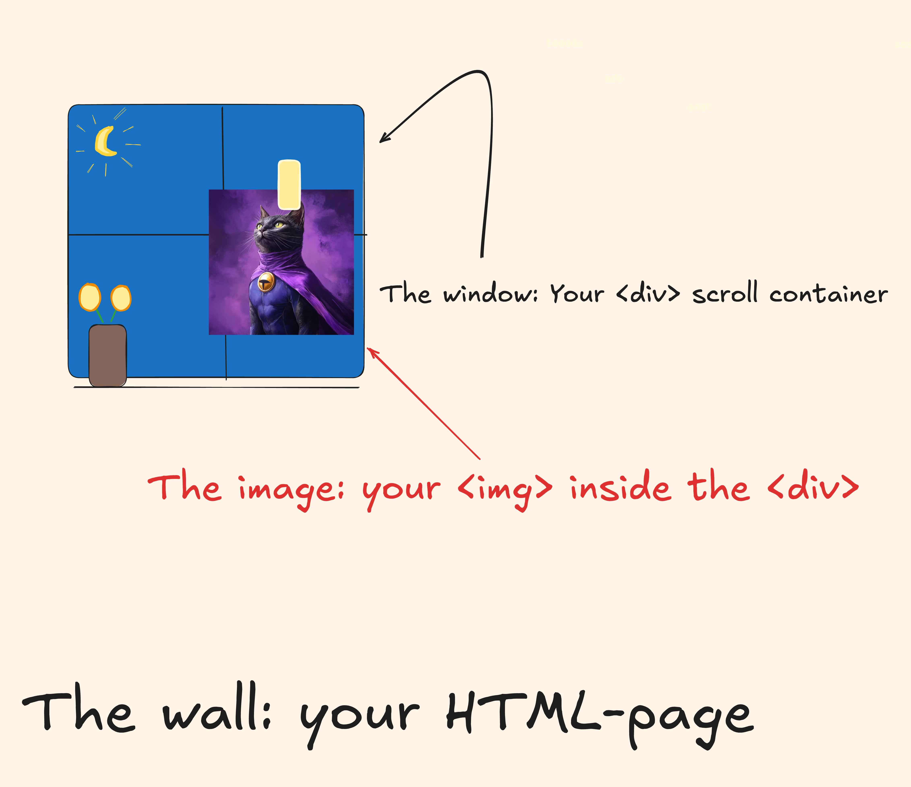
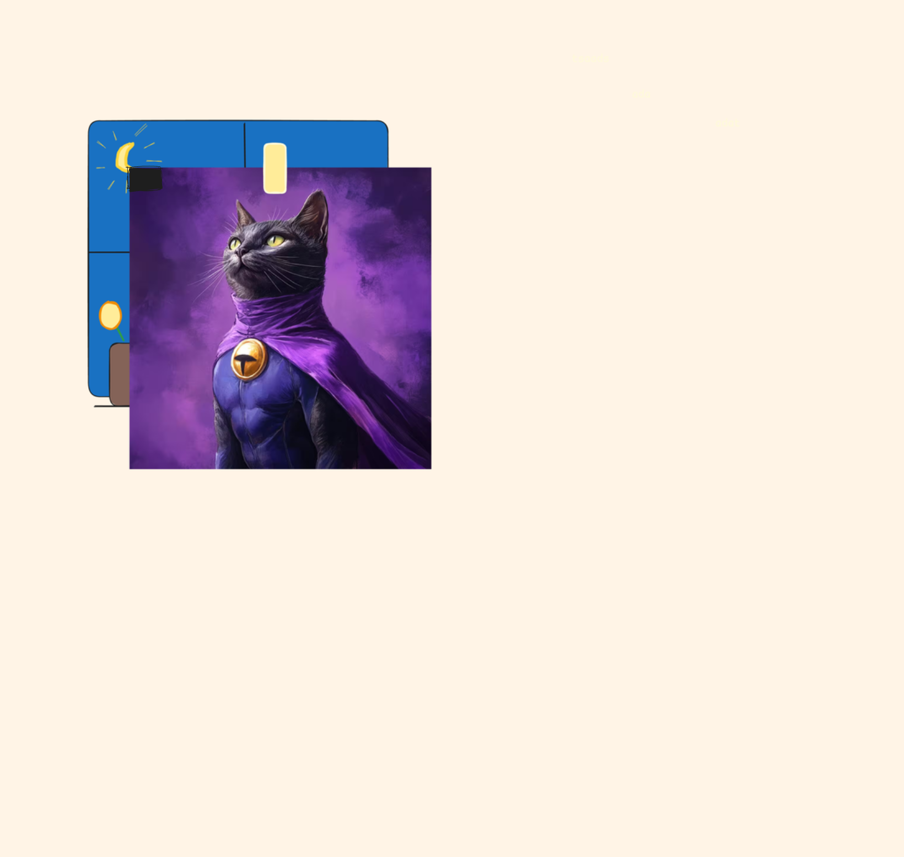
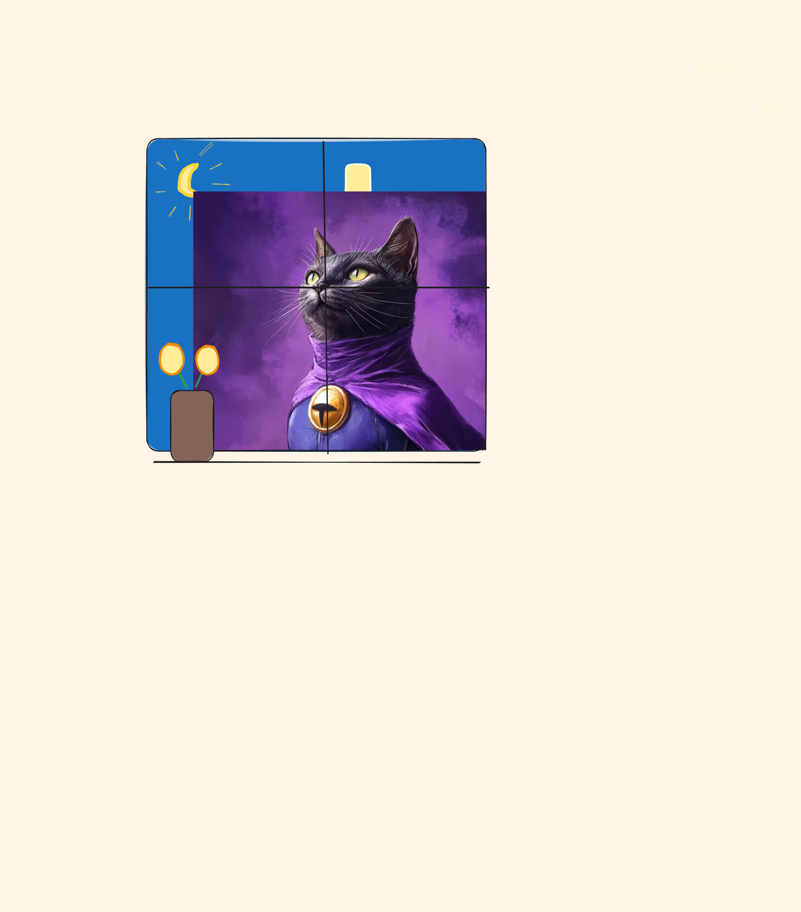

When something is overflowing, it just means it's too big to fit inside the thing it's in. Like pouring too much water into a glass — the water spills over. That's overflow.
It happens in the real world, and also in the world of CSS.

I say **CSS** here, because overflow usually occurs when you give elements fixed widths or heights. It's kind of hard to overflow with just plain HTML — unless you toss in a mega-large image or an unbreakable word.

For example, if you have a `<div>` with a fixed width of 200px and you put a `
` inside it with a long word like "supercalifragilisticexpialidocious", the word will overflow the container. 

```html
<div class="container">
  
supercalifragilisticexpialidocious

</div>
```

```css
.container {
  width: 200px;
  border: 1px solid black;
}
```

Normally, text wraps automatically (especially inside paragraphs), so it won't overflow unless you stop it from wrapping or give it nowhere to go.

```css
    p {
      /* default value */
      /* lines wrap */
      white-space: normal; 
    }
	
    p {
      /* lines don't wrap */
      white-space: no-wrap; 
    }
	
```

This example is just one of many that shows how it's often the author (you) who breaks things by adding CSS to an otherwise inherently responsive base. User agent styles — the default styles applied by the browser — are typically quite flexible and responsive by default.

  
**Agent** = a person who acts on behalf of another person or group.

  

  A **user agent** is the software (usually a web browser) that acts on behalf of the user to retrieve, render, and display web content. It also applies default styles to HTML elements via a built-in **user agent stylesheet**.

So back to the example of the overflowing glass of water. Let's say we have this structure:

```html
<div class="glass">
  
</div>
```
```css
  div.glass {
    height: 200px;
  }
  img.water {
    height: 400px;
  }
	
```

The `` is much larger than its container and would therefore "spill out". The glass would overflow, causing a bit of a mess.

This can cause problems, especially if the overflow happens on the _x-axis_, giving us that dreaded horizontal scrolling ( which is really bad UX).

To control this behaviour we have the `overflow` property in CSS, which is a shorthand for: `overflow-x` and `overflow-y`.
This means that if we give it one value it would resolve to both the x- and the y-axes. And if we give it two values the first one would be for **x** and the second for **y**.

```css
  img {
    /* both axes - x and y */
    overflow: hidden; 
  }
  img {
    /* hidden for x - visible for y */
    overflow: hidden visible; 
  }
  ```
## Preventing overflow
So, what options do we have to prevent overflows? 
Well, we could either just "hide" the parts that are overflowing. Or we could create a [scroll container](https://developer.mozilla.org/en-US/docs/Glossary/Scroll_container), to make the overflow scrollable. A scroll container you say? What the hell is that?

Well here is the definition from [MDN](https://developer.mozilla.org/en-US/):
A **scroll container** is an element box in which content can be scrolled, whether or not scroll bars are present. A user agent adds scroll bars to an element box to make it a scroll container when the CSS `overflow` property is set to `scroll` or when `overflow` is set to `auto` _and_ the content overflows the container.

  `overflow:hidden` also creates a scroll container, even though you can't scroll it. The content could still be scrolled programmatically, but the user can't do it.

 

Bunch of words... Lets simplify: A _scroll container_ is a HTML-element that has `overflow` set to either `scroll` or `auto`. Meaning that if you cram something inside of this element that doesn't fit, would make it scrollable instead of it overflowing. 

Like, think about it. This is kinda genius. It pretty much becomes a magic box that you could put anything and everything inside of, without it spilling out. Imagine if you could have a scrollable backpack or something. You'd fit all your belongings in there.

## Ok, so whats the difference between scroll and auto?
Shit... yeah i guess i'll have to try and answer that.
According to _MDN_, `overflow: scroll` will make the user agent display scroll bars whether or not any content is overflowing. A benefit of this would be that it prevents scroll bars from appearing and disappearing as content changes.

`overflow: auto` unlike `scroll`, only shows scroll bars if the content is overflowing.

However, when i tried both `scroll` and `auto` i did not find any notable difference. When using `scroll` on an element that wasn't overflowing, i did not get any scroll bars. So, unless i'm missing something, they pretty much behave the same way in practice.

**Sick!** What more values could we throw at overflow?

Here is the list:
```css
/* Keyword values */
overflow: visible;
overflow: hidden;
overflow: clip;
overflow: scroll;
overflow: auto;
```

All elements have `overflow` set to `visible` by default. That just means: if you put something big inside something small, the overflow will spill out and still be visible.

`overflow: hidden` hides the parts that don't fit — no scrollbars, no way to reach them. Just clipped. It's like putting a small picture frame over a much larger photo, and then snipping off the parts that stick out. Clean and static.

But — and here's where the metaphor breaks down a bit — the content isn't actually gone. Unlike scissors cutting a photo, `overflow: hidden` doesn't remove the overflow, it just hides it from view. The content is still there in the DOM and can affect things like _focus_, _screen readers_, or _JavaScript measurements_.

By setting an elements `overflow` property to either `hidden`, `scroll` or `auto`, you are creating a new [block formatting context](https://developer.mozilla.org/en-US/docs/Web/CSS/CSS_display/Block_formatting_context) (BFC).

Ok, _WTF_ is that?

Yeah, this is a whole topic on its own — but here’s the short version:
**A Block Formatting Context (BFC)** is a special kind of layout container in CSS. It keeps what’s inside it separate from what’s outside in two important ways:
- **Floats outside won’t affect it** — elements inside a BFC won’t overlap with floated elements that live outside of it.
- **Margins won’t collapse across the boundary** — vertical margins inside the BFC won’t “merge” with margins outside it.

Floats and margin collapsing... do i need to know about this? Maybe not, but it's good to understand that when you change certain properties, you also change how CSS renders certain parts of a web page. _Flex_ and _grid_ children that are not themselves _grid_ or _flex_ containers, also create new BFCs, for example. _Grid_ and _flex_ containers create something similar to a BFC - _grid/flex formatting contexts_,  which behave similarly in some ways (like float containment) but are **distinct layout models** with their own rules.

Here is a short example showing margin collapsing:
```html
  <section>
    <article>
      
hello

    </article>
    <article>
      
hello

    </article>
  </section>

```
```css
  article {
    margin-top: 0;
    margin-bottom: 0;
  }

  p {
    margin-top: 10px;
    margin-bottom: 10px;
  }

```

How much `margin` is it between the articles? Should be `10px` + `10px`, right? But no, the top and bottom margin would collapse here, effectively making it `10px` of margin between the articles. 

## How margins really work
This example also touches on how margins really work. You'd think that the margin would "push" the `
` `10px` down from the `article` "ceiling" and `10px` up from the `article`'s "floor". But this really is the job of paddings. Margin doesn't increase gaps between a child and its parent's boundings. **Its purpose is to increase the gap between adjacent elements - siblings.**

Instead it would "bubble" up, or "escape" to it's parent here and collapse with the other article. It would be as if we had put the margins on the `article`. Margins want to increase the space between siblings, so this is what it will try to do here even though the margin is set on the child. _Confusing?_ Yeah, it is. But this is how it works.

So, these margins will collapse. But only as long as there isn't "something in between" the two touching elements. That something can be another `<element>`, a `border` or some `padding`. Borders and paddings sort of creates unbreakable barriers that stops the merging or collapsing of margins. 

Think of it as hands reaching out from elements. When two elements meet, their margins don't add up but instead merge together like hands intertwining, taking only the space of the larger margin. Adding padding or borders creates an invisible wall between the hands, preventing them from passing through and intertwining, so margins remain separate and add up rather than collapse.


There is also another way to prevent margin collapse. Remember how we said that elements inside a BFCs vertical margins don’t collapse with those of elements outside? And remember how we talked about how `overflow: auto | hidden | scroll` on an element would create a new BFC?

Sooooo, we could set the overflow on one of the articles to either of these values:

```html
  <section>
    <article class="x">
      
hello

    </article>
    <article>
      
hello

    </article>
  </section>

```
```css
  article {
    margin-top: 0;
    margin-bottom: 0;
  }

  article.x {
    overflow: hidden;
  }

  p {
    margin-top: 10px;
    margin-bottom: 10px;
  }

```

Article **x** now has a _block formatting context_ and it's `margin-bottom` won't collapse with the `margin-top` of the next `article`. 

However, setting `overflow` on an element, just to create a BFC, isn't always a great idea (if you dont also want the overflow behaviour). This is where `display: flow-root` comes in. Its almost like `display: block`, except that it also creates a BFC. Yay 🥳!

The name "flow-root" indicates that we are creating a new root-like element in terms of how it creates context for a flow layout inside. Bunch of words again...

Anyways. Here is a list of stuff that creates **block formatting contexts**:
- The root element of the document. The OG BFC. The `<html>` tag. The only BFC on a page as long as you don't use any of the below stuff.
- Floats 🤢
- Absolute and fixed positioned elements
- Table stuff
- Inline-blocks
- Overflow with values other than visible and clip
- Flow-root
- Elements with contain set to layout, content or paint
- Flex & Grid items
- and some other obscure stuff...

Holy crap, enough with the block formatting contexts already!! Yeah, i know! I don't quite understand them myself. But being aware, just knowing they exist and that they change fundamental behaviour, could make you go "Ah right, this creates a new block formatting context, maybe that's why things are weird", the next time you try to debug some weird margin collapsing or whatever.

## Layout modes
This leads me to stray even further away from the initial topic. Namely to talk a little bit about layout modes in CSS. It's related to BFCs but still different. Basically a BFC is always part of a layout mode, but not all layout modes are BFCs. 

**Layout modes** are broad systems for laying out elements.

 A **BFC** is a specific kind of box inside certain layout modes (mainly block) that affects things like margin collapse and float containment.

Ok, so an element can have a _layout mode_ **AND** a _BFC_? 
_Yes!_ In fact - many layout modes automatically trigger a BFC.

But what is a layout mode? Basically the browser calculates and renders HTML according to a layout algorithm. There are a couple different ones to choose from like: _Positioned, Flex, Grid, Flow and Table_.

By default **all** elements (except for tables) use the _Flow layout (or Normal Flow)_. This is the layout mode that was used when the web was created some 500 years ago, and that is still used today (although now we can opt in to other modes, like _Grid_ or _Flex_). In _Flow_ we have the **block boys**, displaying one after the other, top and bottom. And we have the **inliners**, just lining up next to each other, left and right. They all know about each other and work together to form a layout. But if you, for example, slap a `position: absolute` on an element, that element is now taken out of flow, and can be considered to have gone rogue. It is now an outcast and works independently, ignoring all previous friends and neighbours. It doesn't respect the rules anymore and is basically invisible to the rest of the gang. It has left society entirely. 

## The most stupid metaphor ever
What if you slap `display:flex` or `grid` on an element, would that guy also go completely mental? No, not really. That element would remain within the _normal flow_ with respect to its siblings. It would remain in "Flow City", following its rules and regulations. However... its children would now have a new ruleset to abide by.
It is like that `flex` or `grid` container is a prison building within "Flow City". The prison is still part of society. But inside the prison, a new society would form with a different set of rules to follow. But they'd still have to respect, be aware and adjust to each other and maintain relationships.

Here's also a big difference in how `grid` and `flex` fundamentally works. In grid layouts the parent decides how the layout should behave. In flex - it's the children that decides.
In the Grid prison, it is the warden (the parent) that is in charge, dictating exactly how the prisoners (the children) should behave.
In the Flex prison, the prisoners have rioted, a `<span-iard>` with `flex: 1` is now top dog.

So what is the takeaway here? It's that rules that apply in a _Flow layout_, doesn't necessarily apply in a flex layout, for example. In fact, many properties behave very differently. Widths and heights are good examples of this. They behave pretty intuitively in a flow context. You give something a width of 100% and it takes up the full space. In a grid or flow context, that might not be true, since there is a lot more going on in these layout algorithms.

So, the next time something isn't acting the way you thought it would, try to figure out what layout mode you are in, and go from there. 

## z-index
Another good example is z-index. Imagine you just created a new HTML-doc. You make two divs with different background-colors, put some widths and heights on there, which gives you two boxes of different colors, and since you are in flow mode, they line up as blocks, one at the top, and the other one below it. 
<div style="display: flex; flex-direction: column; align-items: center; margin-bottom: 6rem; color: white;">
  <div style="background-color: coral; width: 200px; height: 200px; display: grid; place-content: center;">A</div>
  <div style="background-color: navy; width: 200px; height: 200px; display: grid; place-content: center;">B</div>
</div>

Now, you decide that you want them to overlap a bit. You put some negative margins on there and yeah, that looks sweet.

<div style="display: flex; flex-direction: column; align-items: center; color: white;">
  <div style="background-color: coral; width: 200px; height: 200px; margin-bottom: -50px; margin-left: 50px; display: grid; place-content: center;">A</div>
  <div style="background-color: navy; width: 200px; height: 200px; display: grid; place-content: center;">B</div>
</div>

But wait... you want **A** to be on top of **B** instead. So you remember that there is a property that lets you rearrange items on the z-axis. Cool, you slap that `z-index` of 1 on A, and... nothing happens. _WTF?_ You try `z-index: 10`. Nope! 100? Nope. One Thousand? Nein! INFINITY? God, why doesn't it work?

The reason is simple. The `z-index` property doesn't work in a _Flow layout_. Normal flow is fundamentally a **two-dimensional layout system** where elements are arranged either _vertically_ (block elements) or _horizontally_ (inline elements). There's no built-in concept of layers or depth. There is no **[stacking context](https://developer.mozilla.org/en-US/docs/Web/CSS/CSS_positioned_layout/Stacking_context)**. 

## Stacking Context

In order for `z-index` to work it needs to be in a stacking context. A stacking context is a 3D layering system that determines how elements overlap on your screen. Think of it as creating "bubbles" where `z-index` works only within that bubble, not across different bubbles.

Elements in one stacking context don't interact with elements in another - each context is self-contained and treated as a single unit in its parent context. When elements overlap, their stacking order depends on which contexts they belong to.

Stacking contexts are created by the root `<html>` element and by elements with specific CSS properties like `position: absolute` (with non-auto z-index), `flex`, `grid`, `opacity` less than 1, `transform`, `filter`, `isolation: isolate`, and several others.

Ok, phew... that was some detour. Let's get back to overflow with yet another metaphor and some sketchy drawings.

## The Overflow Metaphor

To really hammer home how the property overflow works, i like to think about it all as a **room** with a big old **wall** and a **window**. 

The wall is your page.

Your container `<div>` is the window. 

You place an `` on the window. 



It looks nice. 

You place a bigger `` on the window, but now, it not only takes up the window's space, it also covers a bit of the wall, maybe hiding some picture of your grandfather.



And this, dear conjurers of code, is where the true sorcery of `overflow` begins. You raise your wand, the DOM trembling ever so slightly, and with great flourish and with a twinkle in your eye, you cast the ancient spell:

**"Overflowus hideamus!"**

...and *poof*, the image is no longer on the inside, but on the outside.



As you know, by looking out a window, you can only see what is visible through the window, the rest is "hidden", "cropped off" from view... but it's still there. That is `overflow: hidden` for ya. Now imagine you had some scroll bars on that window, you can scrub 'em up and down to reveal more of the outside environment, that would be `overflow: scroll | auto` for ya.

Now here is a gotcha. Remember how we said that `overflow` is shorthand for `overflow-y` and `overflow-x`? 

You'd think then that you would be able to set `overflow-x` to `hidden` and `overflow-y` to `visible`, to only hide overflow on the x-axis, but no. As soon as you make an element a scroll container (by setting overflow), it will automatically transfer that `` inside of it to the outside of the window (like in the metaphor above). There is no way then to make some part come inside again, its just physically impossible.

In the real world you could probably open the window a bit and let the cat stick its tail back inside again, but in the CSS world, that is not how it works. The `` is now outside of the window and you can't get it back in (unless you remove the scroll container).

You could also think about it as a _stacking context_, where that `` is then moved to the bottom, but since the window is transparent it lets you see parts of it.

 CSS allows mixing values like `overflow-x: hidden` and `overflow-y: visible`, but in practice, browsers ignore the visible part once an element becomes a scroll container (it gets converted to `overflow:auto`). The content is confined to the container’s edges, and trying to “let it spill out” in one direction while clipping in the other just doesn’t work. It’s like trying to open a window on only one side of a sealed frame — the layout model simply won’t allow it.

## Clip 'em
 Ok, so what if we really need to hide something on the x-axis and let it overflow on the y-axis? We’d need something that **doesn’t** create a _scroll container_, right? Because, like we’ve established, a scroll container locks its children out of the house — you can watch them through the window, but they’re not allowed back inside. Ever again 😈.

 Turns out, there’s another (newer) value we can use: `overflow: clip`.

 `clip` works like `hidden` — overflow content is clipped at the element’s _overflow clip edge_. But here’s the key difference: `clip` **doesn’t** create a **scroll container** or a new _formatting context_. That means the children aren’t banished — they can stay “inside,” and you’re free to clip them on one axis and let them overflow on the other.
 


You also get acces to `overflow-clip-margin` which lets you specify how much of the overflow you wanna clip. Pretty neat.

  `overflow-clip-margin` has limited support and only works when both axes are using overflow: clip
